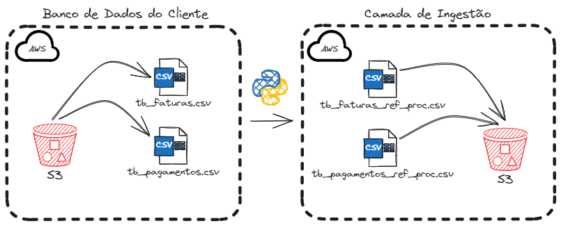

# data_extraction_load_s3

> Author: Danilo Machado

## Introdução

  Este projeto consiste na apresentação da primeira etapa da construção de um Data Lake dentro da AWS. Os dados (fictícios) utilizados foram fornecidos por uma empresa (fictícia) de servições financeiros especializada em cartão de crédito, a qual busca uma solução de engenharia de dados para garantir eficiência e escalabilidade nas suas operações, além de um processamento dos dados que garanta uma capacitação para modelagem preditiva do time de cientistas de dados. 

  
  Nesta primeira etapa, os dados foram extraídos de buckets S3 sob responsabilidade da empresa, que forneceu o acesso necessário. O diagrama a seguir ilustra o processo que foi executado:

  Os dados brutos foram extraídos no formato .csv e salvos localmente incluindo a data de referência (ref) e a data_hora de processamento (proc). Esta etapa foi executada com o script data_extraction_s3_cliente.py.
  Uma vez salvos, o script data_load_s3_ingestion.py varre a pasta data, seleciona os aquivos de interesse a carrega na camada de ingestão do Data Lake.

## Dependências do projeto

- [Python 3.13](https://www.python.org)

## Serviços e recursos

  A tabela abaixo mostra os serviços e recursos da AWS que foram utilizados:
  

| Serviço         | Recurso                           | Descrição                             |
| --------------- | --------------------------------- | ------------------------------------- |
| **IAM**         | Policy                            | EMR, S3 and EC2 Predefined Access.    |
| **S3**          | Data Lake Bucket                  | Storage data source and target.       |

